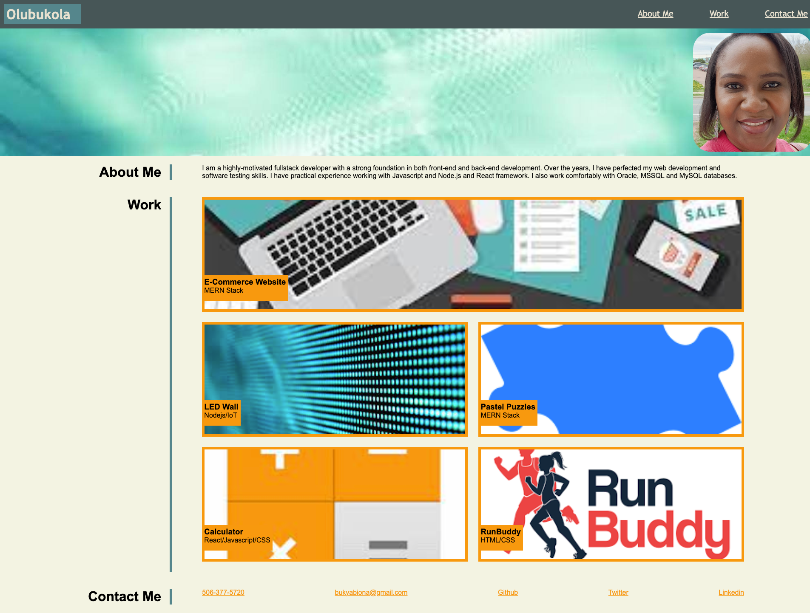

# My-Portfolio

## Description
This is my portfolio where you can view all the projects I have worked on. These projects demonstarate my skills in creating applications using various development frameworks and methods.

I did the following while creating the portfolio:
* Included my name, my picture and links to sections about me, my works and how to contact me
* made the navigation links scroll to the corresponding section when clicked
* made my work section to show titled images of my applications
* made the image of my first application larger than the others
* made the page responsive using media queries

## Installation
The URL of the deployed application is:

You URL of the GitHub repository containing the code is: 

## Usage
You can find the code to the application in my Github account

## Credits
N/A

## License
Please refer to MIT license used in the repo